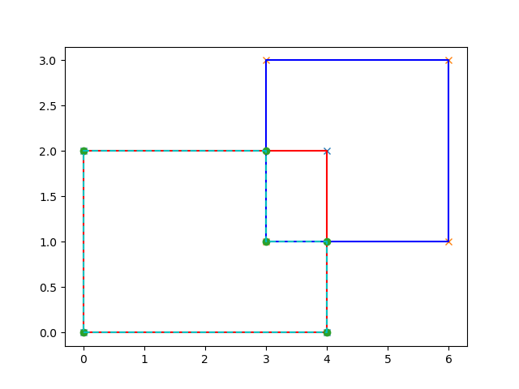

# polygon_intersect
This is a coding task for Turing AI written in C++ programming language.

## Tasks Completed
### Main Tasks
1. Union: Combine multiple polygons into a single polygon.
2. Intersection: Find the common area among multiple polygons.
3. Difference: Subtract one set of polygons from another.

### Bonus Tasks

- Optimize the algorithm for efficiency, especially for a large number of polygons. (attempted)
- Provide visualization of the input polygons and the resulting polygons. (Completed using matplotlibcpp library)

### Compilation Instructions
This C++ code is written in with C++11 version. For the visualisation of the polygons, matplotlibcpp library is used which uses Python3.10 in background.

To compile using the matplotlibcpp library and Python3.10, include paths need to be defined. 

    g++ main.cpp -o main -std=c++11 -I/usr/include/python3.10 -I/usr/lib/python3/dist-packages/numpy/core/include -lpython3.10

where  

    -I/usr/include/python3.10
is the location of the Python header. This location might different in your local machine. The matplotlibcpp.h depends on this python header.

    -I/usr/lib/python3/dist-packages/numpy/core/include
is the numpy Python dependency

    -lpython3.10
is the python library dependency.

For a more complete information on using the matplotlibcpp.h library, refer 

    https://matplotlib-cpp.readthedocs.io/en/latest/compiling.html

## Code Structure

### include/
This folder contains two files

    1. matplotlibcpp.h - The matplotlibcpp library header for visualisation.

    2. polygon.h - This header contains the class Polygon, containing its data and operations including union, difference, intersections.

### main.cpp

This contains the function main() and other wrapper/helper functions.

## Key Points

    1. Polygons can be created by calling the class Polygon constructor passing the vertex pair as a vector. 
    Example:
        Polygon first_polygon({{0, 0}, {4, 0}, {4, 2}, {0, 2}});

    2. It is assumed that the polygons are non-intersecting and the vertices are in order.

    3. Operations are implemented using
        3.1 Difference: Minus (-) operator is overloaded for this functionality to find difference of two polygons.
        Example:
            auto result_polygon = first_polygon - second_polygon;

        3.2 Union: Addition (+) operator is overloaded for this functionality to sum of two polygons.
        Example:
            auto result_polygon = first_polygon + second_polygon;

        3.3 Intersect: member function intersect() is implemented for this functionality to find common area of two polygons.
        Example:
            auto result_polygon = first_polygon.intersect(second_polygon);

    4. For operations mentioned in 3, wrapper functions are implemented to compute, plot and export the figures to png format.
        -do_union(first_polygon, second_polygon);
        -do_intersect(first_polygon, second_polygon);
        -do_difference(first_polygon, second_polygon);

    5. Plots output, the input polygons are shown in red and blue lines with the vertices represented by "x". The resulting polygon is represented by green dashed line with dots representing the vertices.

    Example: 
    
        1. Difference, in the below image the blue polygon is subtracted from the red polygon and the resulting polygon is shown in green dashed lines and green dots.

    
       2. Union, in the below image the resulting polygon from the union of the blue and red polygons is shown in green dashed lines and green dots.

       3. Intersect, in the below image the resulting polygon from the intersection of the blue and red polygons is shown in green dashed lines and green dots.

    